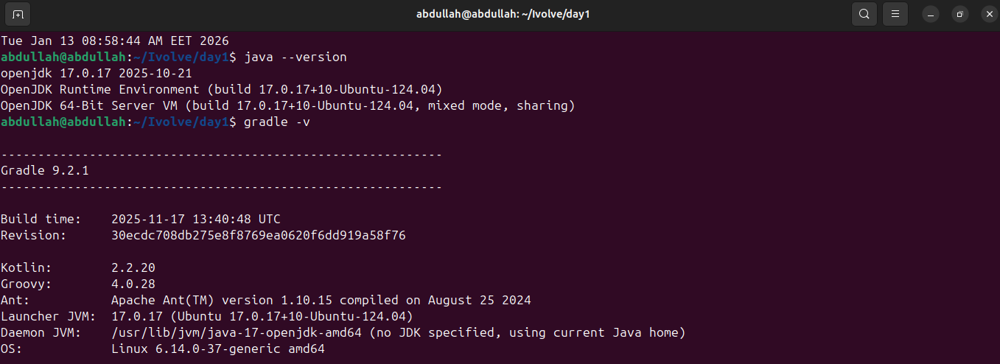
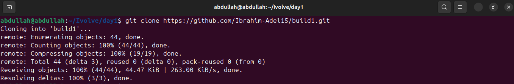
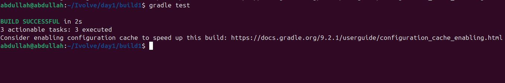
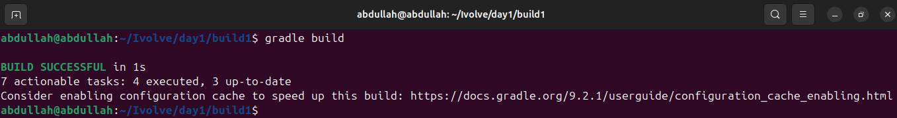
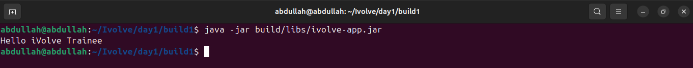

# Lab 1: Building and Packaging Java Applications with Gradle

This lab demonstrates how to build, test, and run a Java application using **Gradle**.

---

## Prerequisites
Make sure you have the following installed on your system:
- Java (JDK 8 or later)
- Gradle
- Git

---

## Step 1: Install Gradle
Verify Gradle version by running:
```bash
gradle --version
```


---
## Step 2: Clone the Source Code
Clone the application repository from GitHub:

---
## Step 3: Run Unit Tests
Execute unit tests using Gradle:

---
## Step 4: Build the Application
Build the application and generate the artifact:

---
## Step 5: Run the Application
Run the application using the generated JAR file:

---
## Conclusion
In this lab, you learned how to:
 - Use Gradle to manage a Java project
 - Run unit tests
 - Build and package a Java application
 - Run the generated JAR file
